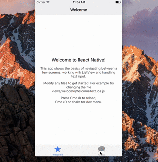

# React Native Level Up News Letter

## Side Notes

Got the original idea/content for this NL from https://www.facebook.com/groups/react.native.community/permalink/922838681185044/

Around 02/19/2017 the React Native team released and officially supported start template that you can generate from the RN CLI.

The code for the app in the GIF is not included in this library since it had to be generated separately I didn't want to spend extra time trying to fit it into this context.

You can reproduce the app with these commands though:

```
react-native init MyApp --version 0.42.0-rc.2 --template navigation
cd MyApp
react-native run-ios
```

## Content



```html
<h1>Introducing App Templates!</h1>

<div class="p1">
<pre>
<code>
react-native init MyApp --version 0.42.0-rc.2 --template navigation
cd MyApp
react-native run-ios
</code></pre>
</div>

<p><span style="font-size:18px">Run the commands above&nbsp;then you&#39;ll be up and running with a sexy&nbsp;React Native template with a few basic scenes + navigation already set-up using the official <a href="https://reactnavigation.org/" target="_blank">react-navigation</a>.<br />
<br />
This&nbsp;template can&nbsp;also serve as a set of best practices on how to build React Native apps: folder structure, naming conventions, etc.</span><br />
<br />
You can check out the template code here: <a href="https://github.com/facebook/react-native/tree/master/local-cli/templates/HelloNavigation" target="_blank">https://github.com/facebook/react-native/tree/master/local-cli/templates/HelloNavigation</a><br />
<br />
Yours,<br />
Tyler Buchea</p>

```
